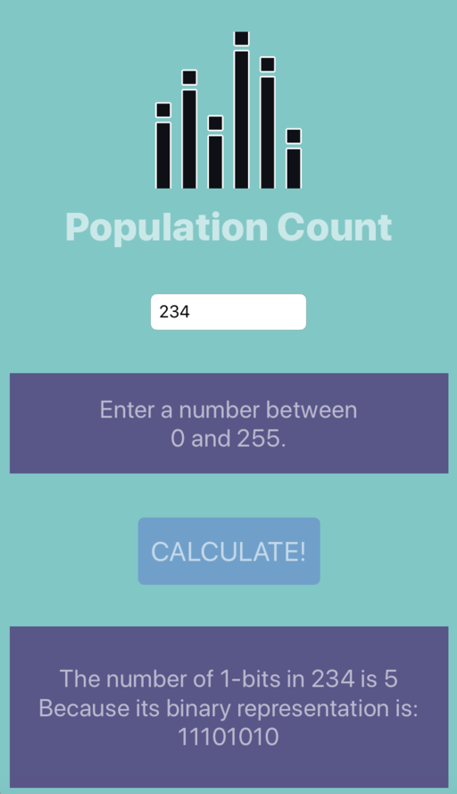

## ARM64 Assembly with Swift and XCode

This code shows a simple bit of embedded ARM64 assembly code in an iOS application. It provides a working demo for my  [blog post](http://mikejfromva.com/2018/05/19/arm64-assembly-with-swift-and-xcode) at [MikeJfromVA.com](http://mikejfromva.com).

## What's Here?

* **ViewController.swift** wires the text entry and text label fields together with the button and does some basic input validation.
* **popcount.c** uses a basic shift-and-compare technique to compute the population count. It is only compiled when the XCode Target is Simulator.
* **popcount.s** uses **cnt**, an Aarch64 instruction, to compute the population count. It is only compiled when the XCode Target is a physical device.
* **ArmAssembly-Bridging-Header.h** provides the function header for both **popcount.c** and **popcount.s**.
* **SimpleFunction.swift** does not actually play a role in the app directly. Compile this into assembly (xcrun -sdk iphoneos swiftc -emit-assembly -target arm64-apple-ios11.0 SimpleFunction.swift) to see some ARM64 operations. Used this as a template for **popcount.s**.